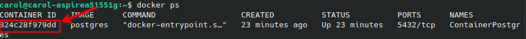

### Adicionar repositorio ao dbeaver

```bash
sudo add-apt-repository ppa:serge-rider/dbeaver-ce
```

### Atualizar pacortes

```bash
sudo apt-get update
```
### Instalando dbeaver

```bash
sudo apt-get install dbeaver-ce
```

#### Adicionando conexão

- Ver id do container

```bash
docker ps
```



- Inspecionar container 

```bash
docker inspect {id_container}
```

- O host será o ip do container


